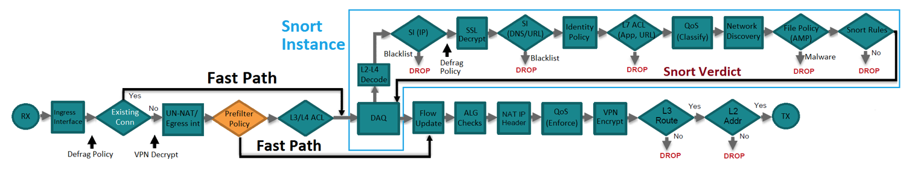
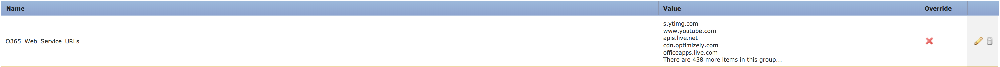
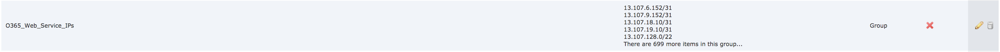
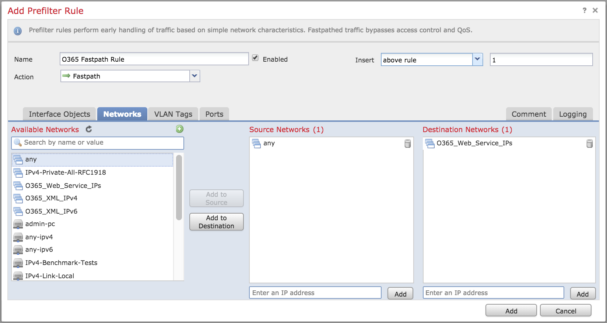
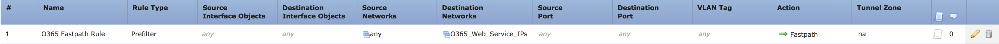
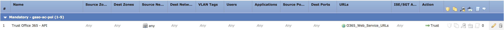

[](https://developer.cisco.com/codeexchange/github/repo/chrivand/Firepower_O365_Feed_Parser)

# O365 Web Service API to Firepower Objects Parser 

This is a sample script that parses the [NEW O365 Web Service API](https://docs.microsoft.com/en-us/office365/enterprise/managing-office-365-endpoints#webservice) that Microsoft publishes with URL, IPv4 and IPv6 addresses. These addresses are used for the infrastructure of the Microsoft cloud applications (e.g., Office 365). The script will parse the NEW O365 Web Service API into 2 separate lists and use the FMC API to upload them into 2 Group Objects. These Group Objects can be used in a Firepower trust/prefilter rule. By doing so the traffic is excluded from further inspection, to prevent latency issues with the Microsoft O365 applications. 

Please contact me, Christopher Van Der Made <chrivand@cisco.com>, if you have any questions or remarks. If you find any bugs, please report them to me, and I will correct them (or do a pull request).

## Features

* Retrieving Wordlwide URLs and IPs from new O365 REST-based web service; 
* Parsing these into 2 flat lists (URL and IP (mixed IPv4 and IPv6));
* Creating right JSON format for FMC API PUT requests;
* Uploading this JSON to FMC, overwriting the previous Group Object;
* If no objects have been created, 2 overridable objects will be created: 'O365_Web_Service_IPs' and 'O365_Web_Service_URLs';
* Checking if O365 file was updated, using the O365 Version API Endpoint;
* Automatic policy deploy using API when changes were made to Objects (optional, caution this will also deploy other, unrelated policy changes);
* Webex Teams alert when changes were made to Objects;
* Continuously checking for updates with a specified time interval (optional).

### Potential next steps

* Create extra modules for other SaaS applications;
* Create extra modules for other Cisco solutions (WSA, Umbrella, etc.).


## Solution Components

The script consists of 3 python files. The main script can run indefinitely, leveraging a function that is built in, to rerun the script every x amount of seconds (it can also just be executed once). Then, using the Version API Endpoint, the script checks if changes were made to the Web Service list. If changes were made, the Web Service list is parsed and uploaded using a PUT request to FMC. Microsoft updates the Office 365 IP address and FQDN entries at the end of each month and occasionally out of cycle for operational or support requirements. Therefore, Microsoft recommends you check the version daily, or at the most, hourly. This can be automated with the script.

### Cisco Products / Services

* Cisco Firepower Management Center;
* Cisco Firepower Threat Defense NGFW.


## Installation

These instructions will enable you to download the script and run it, so that the output can be used in Firepower as Group Objects. What do you need to get started? Please find a list of tasks below:

1. You need the IP address (or domain name) of the FMC, the username and password. These will be requested by the script the first time it is run. It is recommended to create a separate FMC login account for API usage, otherwise the admin will be logged out during every API calls. Add the IP/Domain of FMC, the username and password to the config.json file.

2. In the FMC, go to System > Configuration > REST API Preferences to make sure that the REST API is enabled on the FMC.

3. A Network Group object and a URL Group object will be created automatically during the first run of the script. However, if you'd rather create the objects manually, you can follow the instructions below.

4. It is also recommended to download an SSL certificate from FMC and put it in the same folder as the scripts. This will be used to securely connect to FMC. In the config.json file, set the *"SSL_VERIFY"* parameter to *true*, and then set *"SSL_CERT"* to be the path to the FMC's certificate.

5. It is possible to integrate the script with Webex Teams. In order to do that, an API Access Token and a Room ID needs to be entered in the **config.json** file. Please retrieve your key from: https://developer.webex.com/docs/api/getting-started. Then create a dedicated Webex Teams space for these notifications and retrieve the Room ID from: https://developer.webex.com/docs/api/v1/rooms/list-rooms. 

6. In this same Webex Teams room you can subscribe to an RSS feed from Microsoft regarding updates. Use this bot to integrate the RSS feed into your Webex space: https://apphub.webex.com/bots/rss-2739. The RSS feed URL can be found on the Microsoft website (link on top of this page).

### Manual Object Creation (Optional)

1. Create 2 Group Objects in FMC: "O365_Web_Service_URLs" (URL Group Object) and "O365_Web_Service_IPs" (Network Group Object). At first you will have to put in a random URL/Network to create the group objects. No worries, we will override this later.

2. Use the FMC API Explorer to do a GET request for the Network Group Objects. This is done by going into the FMC API Explorer (can be reached at https://IP-addressOfFMC/api/api-explorer), and then clicking on *"Object"* in the left menu. The scroll down to *"networkgroups"* and click on *"GET"* and then again on *"GET"* in the right menu. 

3. Now you will need to copy-paste the Object IDs of the Network Group Object (*"O365_Web_Service_IPs"*). The IDs will look like the following format: *"000XXXX-YYYY-ZZZZ-0000-01234567890"*. This is displayed in the *"Response Text"* output box in the right menu. You will need these later in the PUT requests to update the objects. Below is an example of how this output would look for the *"O365_Web_Service_IPs"* Network Group Object:

```
"type": "NetworkGroup",
"name": "O365_Web_Service_IPs",
"id": "000XXXX-YYYY-ZZZZ-0000-01234567890"
```

4. Repeat the GET request of step 2 as well for *"urlgroups"*, to obtain the ID for the URL Group Object (*"O365_Web_Service_URLs"*). You should now have two IDs copy-pasted, which you can put inside the *config.json* file as *"IP_UUID"* and *"URL_UUID"* to configure the script.

### How to use the Group Objects in Firepower Management Center.

For better understanding of the packet flow in Firepower Threat Defense, and how the Fastpath action in the Prefilter Policy works, please review the following flow diagram:    



After the successful PUT requests, the 2 Group Objects will have been updated with the new IP-addresses and URLs. Please find screenshots of the 2 Group Objects, after the API call:





These objects can be used in either Prefilter Policy Fastpath-rule (for the Network Object), or in an Access Control Policy Trust-rule (for the URL Object). This is an example of how to configure the Prefilter Policy rule in FMC:



This will result in the following rule:



Likewise, this can be done with a Trust Rule in the Access Control Policy for the URL Group Object:



As a final step you will need to do a Policy Deploy, each time that the Group Objects have been updated. This can be done from the FMC by clicking on *"DEPLOY"* and by selecting the device that need this Policy Deploy.

### Please take caution on the following notes:

* Please be aware that a policy redeploy is needed to update the Group Objects in the used Policies. Currently there is an optional API call built in to do a policy redeploy, however please take caution in using this, since this might cause other, unrelated policies or objects to be deployed (e.g., if another network administrator is working on a Policy in the GUI).

* Important is to use SSL verification and to test the script before running this in a production environment. In the config.json file, set the *"SSL_VERIFY"* parameter to *true*, and then set *"SSL_CERT"* to be the path to the FMC's certificate.

* Please test this properly before implementing in a production environment. This is a sample script.

* In case the intervalScheduler is used: the running script should be hosted in a secure environment! For example: if a malicious actor can place additional IP-addresses or URL's in the list somehow, they will be put in a Firepower trust rule, and might cause the malicious actor to bypass security.


## Author(s)

* Christopher van der Made (Cisco)
* Alan Nix (Cisco)

